# Project Description  
EduOrigin is an android app that is based on online learning. Here a user can log in and register to the user panel and the sessions of user are managed properly. Then, a user can read various types of programming and sofware related books. He/She can search specific books through kewords. Besides, he/she can give online quizes and gain scores. Here, a user can go through many online resources for the learning purpose.
Besides, there is an admin panel in this app. An admin can login to the admin panel and upload new books with pdf and also create quizes for the users. All the books and quizes are added and updated instantly in RecyclerView.

## Features:
1. User Login and Registration System
2. User Authentication and Session Management System
3. Online Book Library and Book Reading System
4. Online MCQ with Scoring System
5. Particular Book Searching System Through Keywords
6. Admin Panel for Creating Quizes and Uploading Books
7. Learning from Many Online Resources through Web View
8. Realtime Book and Quiz Updating System

### Languages: 
Java, PHP
### Databases:
MySQL, SharedPreferences
### Tools and Technologies: 
Android Studio, PhpMyAdmin

## Project Demo:

### Animated Splash Screen:
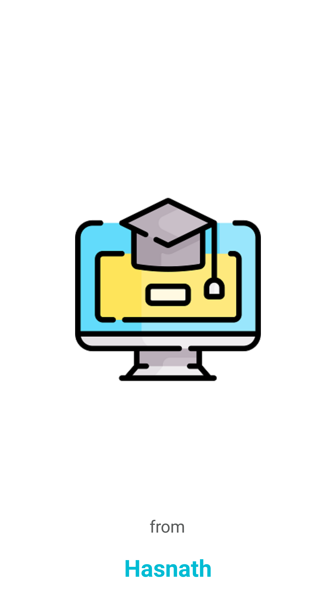 

### Login and Registration System
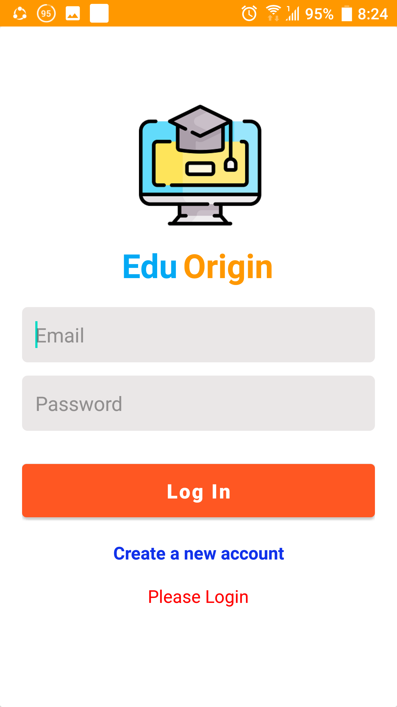      

### Admin Panel (Book Uploading System)
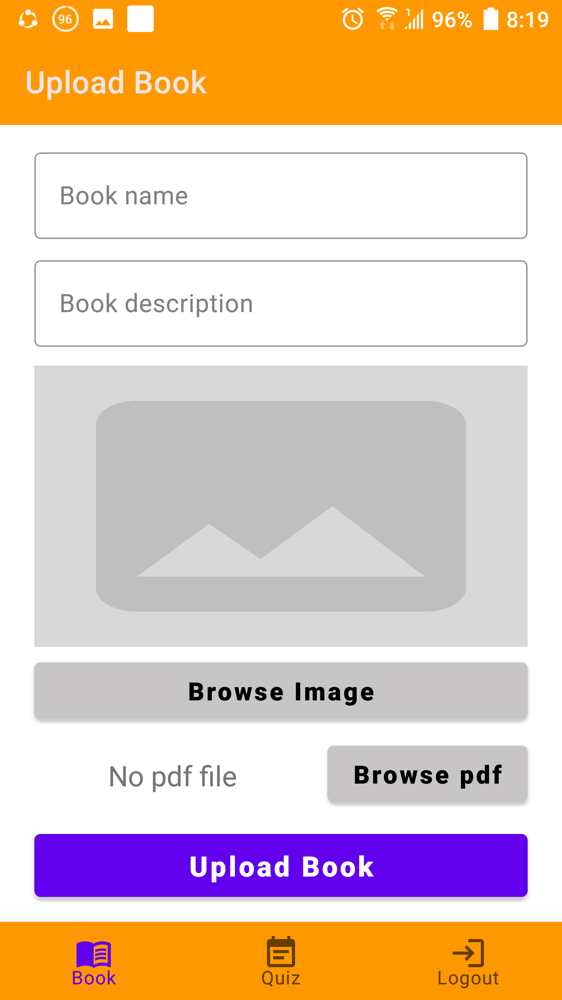  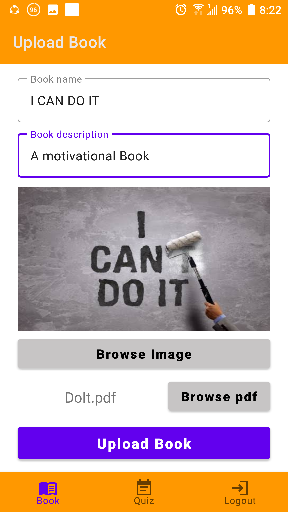 

### Admin Panel (Quiz Creating System)
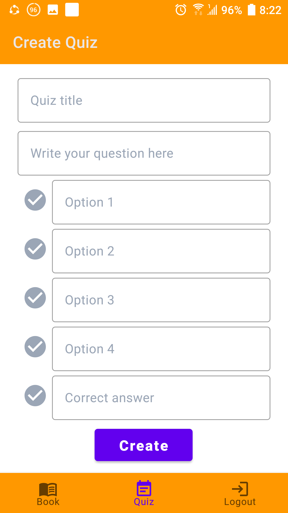  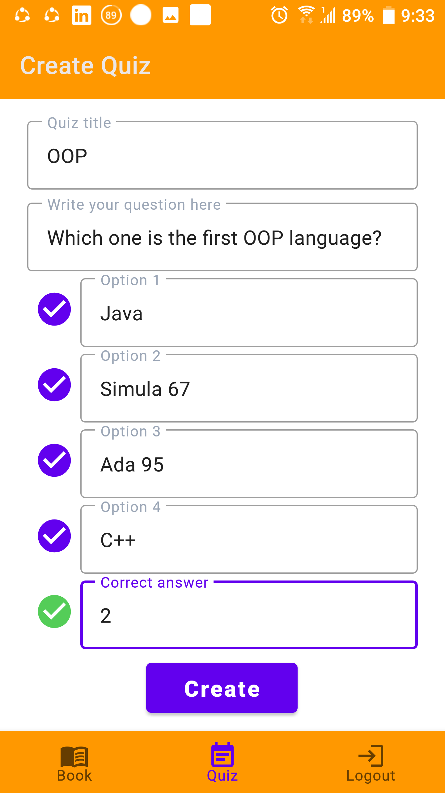 

### Book Library System
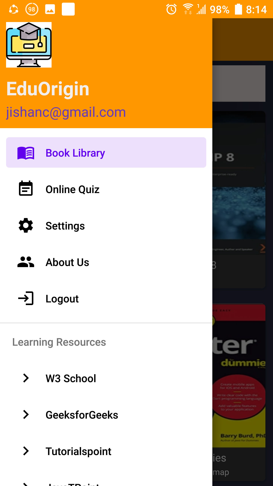  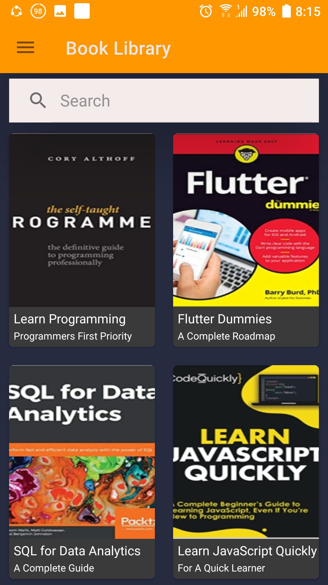  

### Particular Book Searching System
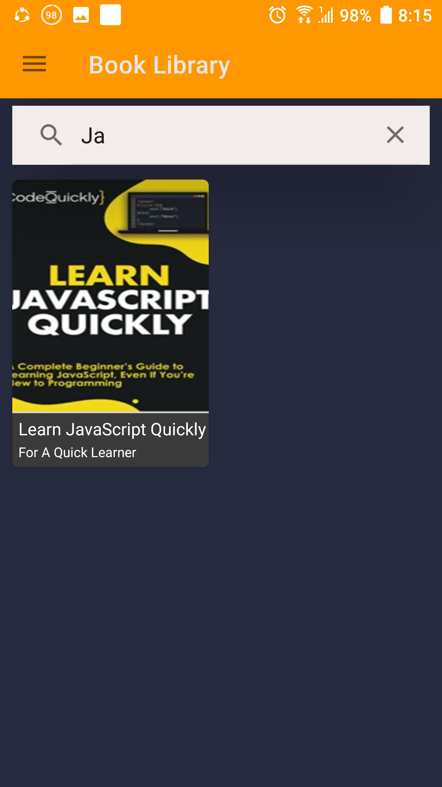 

### Online Quiz System
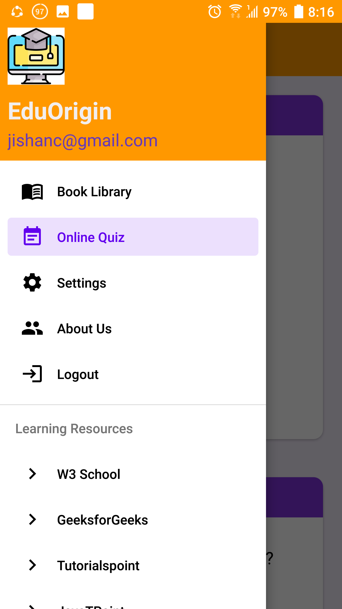  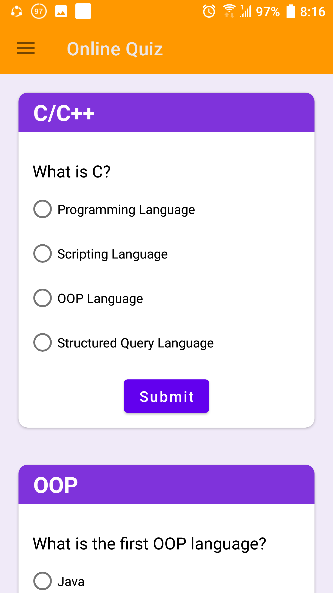 

### Quiz Scoring System
  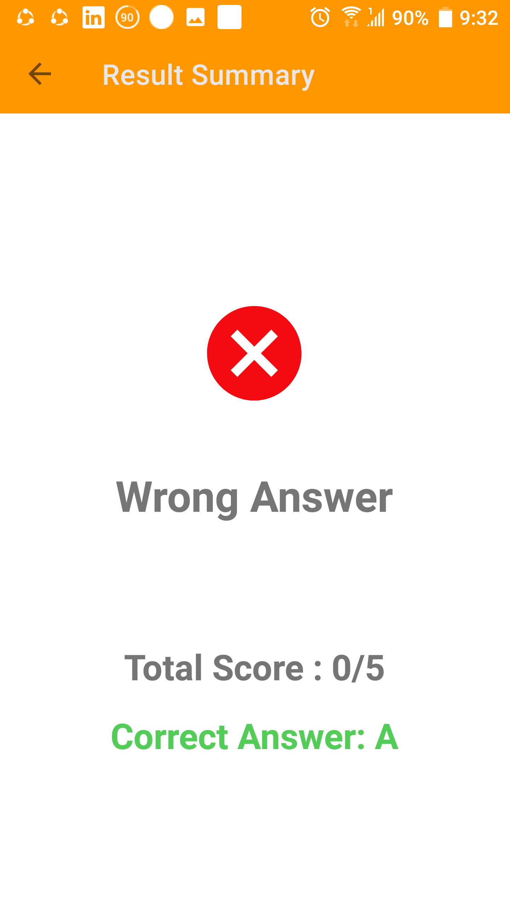 

### Online Learning Resources System

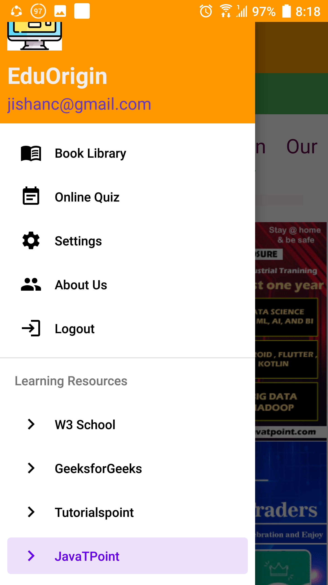  

## Topics:
1. Animated Splash Screen    
2. RecyclerView    
3. CardView    
4. Adapter    
5. Material UI Design   
6. Dexter     
7. PDF Viewer   
8. Live Data    
9. MySQL Database       
11. Retrofit    
12. Glide    
13. WebView    
14. API CALL  
15. API Development and Integration  
16. Material Components
17. User Registration and Authentication
18. User Session Management
19. Admin Session Management

